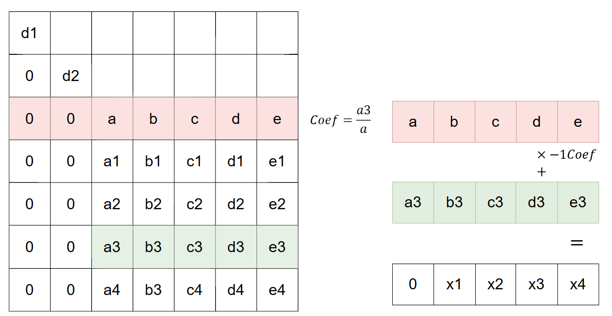
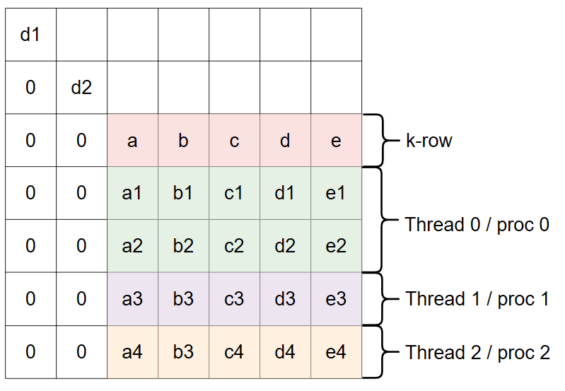
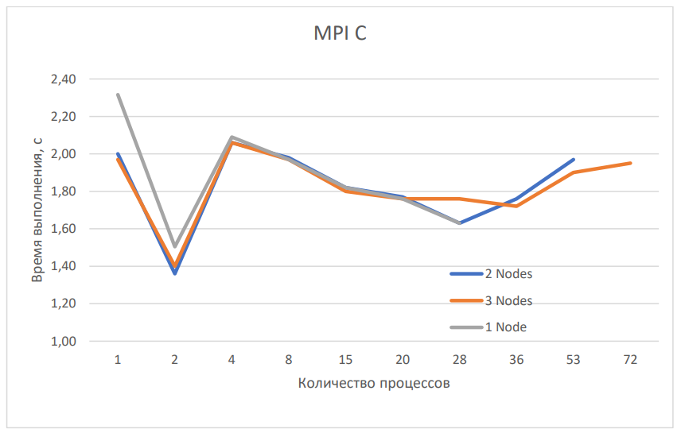
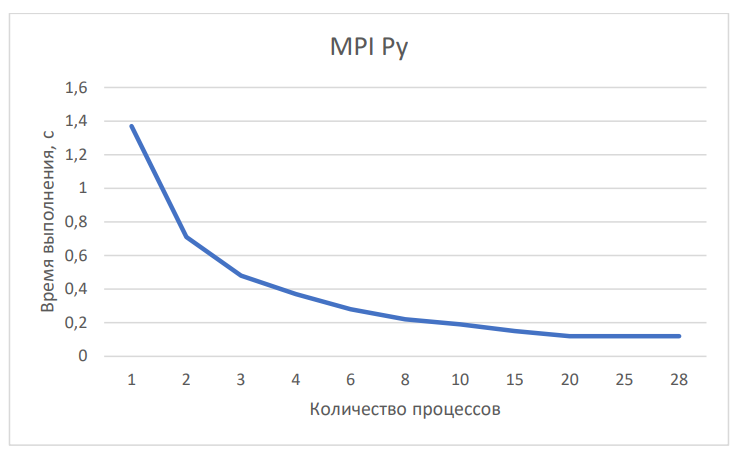
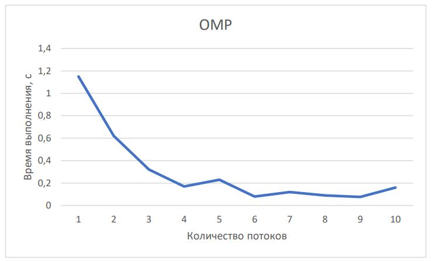
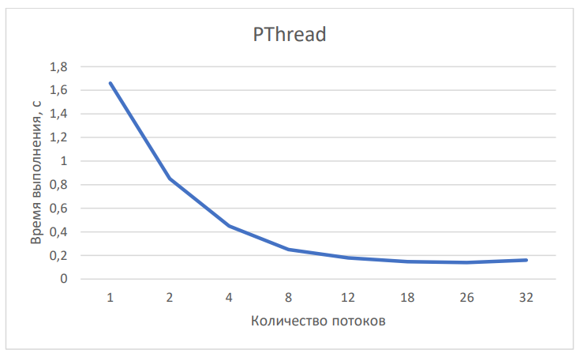

# Сalculation determinant of the matrix using the modified Gauss method 
## Build and run  
- Create and **activate python venv**  
- Install dependencies for Python from `.requirements`  

You can chenge number of process and threads in `./Makefile`. After run you should enter matrix shape in `stdin`.

- MPI C  
`make mpi_c`
- MPI Python  
`make mpi_py`  
- OMP  
`make omp`  
- PThreads  
`make pthread`    
- clear  
`make clear`  

## Testing   
Recommended choice of matrix size:   
- For C programs: N>800. For Python: N>200   

Go to `./tests` folder and use the same commands as in point **Build and run**.  

## Method idea  
Bringing the matrix to an upper-triangular appearance  
  
### Parallelization idea  
Send to each process or thread respective rows  
  

## Results  
The results are obtained for a 1000x1000 matrix for programs written in C and for a 350x350 matrix for MPI on Python  
- MPI C with different number of proccess and nodes  
 
- MPI Python   
  
- OpenMP  
  
- PThread  
